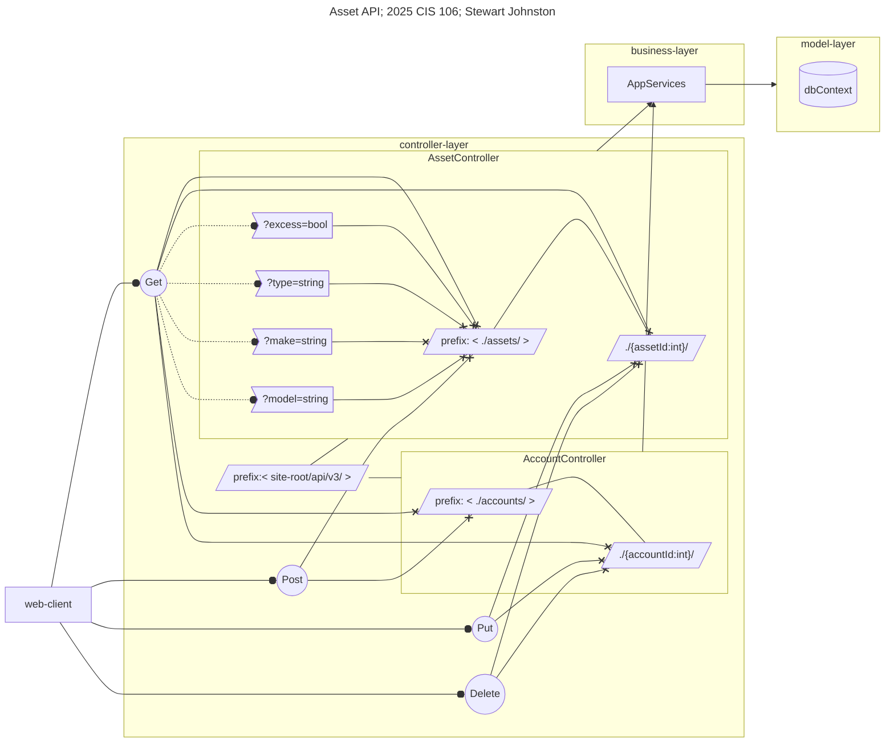

# api design

```mermaid
---
title: Asset API; 2025 CIS 106; Stewart Johnston
---

flowchart LR
    web-client --o Get
    web-client --o Post
    web-client --o Put
    web-client --o Delete

    subgraph controller-layer
        id_papi[/prefix:< site-root/api/v3/ >/] --- AssetController
        id_papi[/prefix:< site-root/api/v3/ >/] --- AccountController

        Get((Get))
        Put((Put))
        Post((Post))
        Delete((Delete))

        Get --x id_pa
        Post --x id_pa
        
        Get --x id_asset
        Put --x id_asset
        Delete --x id_asset

        Get -.-o opt_excess
        Get -.-o opt_type
        Get -.-o opt_make
        Get -.-o opt_model

        subgraph AssetController
            id_pa[/prefix: < ./assets/ >/] --- id_asset[/"./{assetId:int}/"/]
            opt_excess>?excess=bool] --x id_pa
            opt_type>?type=string] --x id_pa
            opt_make>?make=string] --x id_pa
            opt_model>?model=string] --x id_pa
        end

        Get --x id_pacc
        Post --x id_pacc

        Get --x id_account
        Put --x id_account
        Delete --x id_account

        subgraph AccountController
            id_pacc[/prefix: < ./accounts/ >/]
            id_account[/"./{accountId:int}/"/]
            id_pacc --- id_account
        end
    end

    subgraph business-layer
        AppServices
    end

    AssetController --> AppServices
    AccountController --> AppServices
    AppServices --> model-layer

    subgraph model-layer
        dbContext[(dbContext)]
    end
```
