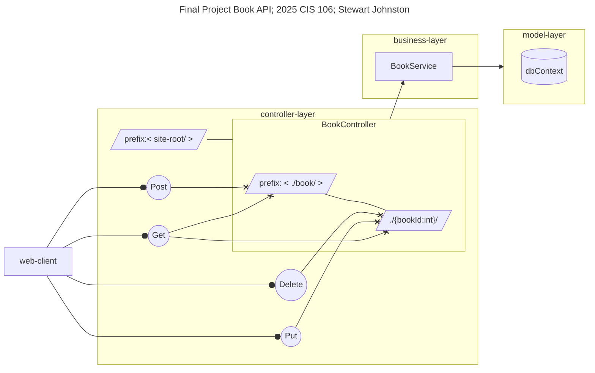

NCMC CIS 106  
Final Assignment  
Stewart Johnston  
2025-05-12  

```sh
cd 106_final
dotnet tool install --global dotnet-ef
dotnet ef migrations add InitialCreate --context BookContext
dotnet ef database update --context BookContext
dotnet run
```

CRUD for books. Didn't get around to authors or any such else, but I am checking
for uniqueness of the book author + title + genre, which turned out to be a huge
pain in the butt.

Adding a new book uses Post on site-root/book. Get on that target will return
the whole list. Get, Put, or Delete armed with an id at site-root/book/id do
what you think.

I had to involve some JIT expertise on getting Dependency Injection working. You
can read in the commit log my thought process as I moved away from using a
static BookService as my data repo towards providing BookService with a
dbContext, and the constraints I was working on to make it testable. That
invoked a good deal of debugging, as well as the effort to get uniqueness
working on the real database.

What I suspect, is that EntityFramework's Sqlite in-memory provider will do a
lot of things more aggressively, and more correctly, using the assemblies as
compiled. For example, in order to implement my first go round with enforcing
uniqueness of book entries, I was forced to write a custom Equals
implementation, etc, on the Book model. The in-memeory database seemed to be
calling that custom equals method just fine, but the on-disk database provider
was, I think, trying to convert the `==` operation into an SQLish equality. I'm
not sure precisely how that's implemented, but 10$ will get you 20$ that it has
nothing to do with calling the assembly's equality methods.

I also was banging my head on the desk for a *long* time about the LINQ pattern
of `.DefaultIfEmpty()` and `.FirstOrDefault()`. Those currently do *not* have an
implementation to translate them for SQL if they have a parameter to, y'know,
change the default. Grumble-grumble. I was deeply angered by that bug, because it was so inscrutable.


